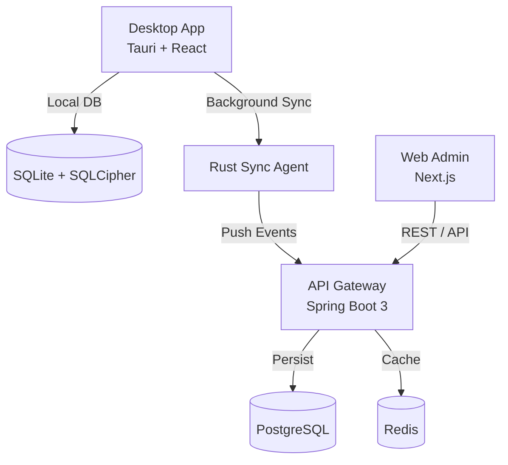

# Parkflow Monorepo

<div align="center">
  <p>A comprehensive, desktop-first parking management platform built for scalability, offline resilience, and enterprise needs.</p>

  <!-- Badges -->
  [](#)
  [](#)
  [](#)
  [](#)
  [](#)
  [](#)
</div>

---

## Table of Contents

- [Architecture](#architecture)
- [Key Features](#key-features)
- [Getting Started](#getting-started)
- [Testing](#testing)
- [Default Credentials](#default-credentials)
- [Documentation & Resources](#documentation--resources)
- [Security Practices](#security-practices)
- [Contributing](#contributing)

---

## Architecture

ParkFlow implements a true **Local-First Architecture**, ensuring 100% autonomous operation without relying on a central cloud database when offline.



### Apps
- **`apps/desktop`**: Tauri v2 application acting as the primary point of sale, hardware integration hub, and synchronization agent.
- **`apps/web`**: Next.js application serving as the central administration panel for tariffs, users, and reporting.
- **`apps/api`**: Spring Boot 3 backend handling core business logic, authentication, auditing, and data synchronization.

### Packages
- **`packages/types`**: Shared contracts (v1), definitions (e.g., `TicketDocument`), and ticket preview layouts.
- **`packages/print-core`**: Shared thermal printing utilities and formatting tools.

---

## Key Features

- **Hybrid Execution Modes (`PARKFLOW_MODE`)**:
  - `local`: 100% standalone operation using SQLite (encrypted via SQLCipher).
  - `sync`: Local-first operation with an asynchronous Rust background worker pushing events to the cloud when online.
  - `cloud`: Direct-to-cloud operation for constantly connected environments.
- **Enterprise Licensing System**: Built-in support for hybrid SaaS models (Local, Sync, Pro, Enterprise) with offline validation, hardware fingerprinting, and anti-tampering measures.
- **Advanced Security & Auth**: JWT-based authentication with short-lived access tokens and rotating refresh tokens, comprehensive audit logging, and strict rate limiting.
- **Offline Capabilities**: Full functionality during network outages with guaranteed eventual consistency.

---

## Getting Started

### Prerequisites

Ensure you have the following installed on your machine:
- **Node.js 18+** & **pnpm**
- **Java 21 (JDK)**
- **Docker** & **Docker Compose**
- **Rust** (for Tauri desktop compilation)

### Initial Setup

1. **Verify Ports Availability**:
   ```bash
   pnpm ports:check
   ```
2. **Start Infrastructure (PostgreSQL)**:
   ```bash
   pnpm db:up
   ```
3. **Environment Variables**:
   Copy `.env.example` to `.env` and set the required keys:
   ```bash
   cp .env.example .env
   ```
   Set up your security credentials:
   ```bash
   export PARKFLOW_JWT_SECRET_BASE64="REPLACE_WITH_BASE64_JWT_SECRET"
   export PARKFLOW_API_KEY="REPLACE_WITH_SECURE_API_KEY"
   ```
   *(For Windows use `set` or `$env:` depending on CMD/PowerShell)*

### Running the Application

ParkFlow features automatic port fallback to ensure smooth development.

```bash
# Start the Spring Boot API (Primary: 6011, Fallback: 6012)
pnpm dev:api

# Start the Next.js Web Admin (Primary: 6001, Fallback: 6002)
pnpm dev:web

# Start the Tauri Desktop Client
pnpm dev:desktop

# Start the Print Agent
pnpm dev:print-agent
```

---

## Testing

The repository uses robust testing practices encompassing Unit, Integration, and E2E tests:

```bash
# Run all tests across the monorepo
pnpm test

# Run API tests (Spring Boot)
pnpm test:api

# Run Web Admin unit tests (Vitest/Jest)
pnpm test:web

# Run End-to-End (E2E) tests with Playwright
pnpm test:e2e
```

---

## Default Credentials

Upon the first launch in `local` or `sync` mode, the database is seeded automatically:

| Role | Email | Password |
|------|-------|----------|
| Super Admin | `admin@parkflow.local` | `Qwert.12345` |
| Cashier | `cashier@parkflow.local` | `Qwert.12345` |
| Operations Admin | `operador@parkflow.local` | `Qwert.12345` |

> **Password Policy**: Minimum 8 characters, requiring uppercase, lowercase, numbers, and special characters.

---

## Documentation & Resources

- **Architecture & Auth**: [Hybrid Auth v1](docs/architecture/auth-hybrid-v1.md)
- **Port Management**: [Port Architecture Guide](docs/architecture/ports.md)
- **API Documentation (Swagger)**: `http://localhost:6011/swagger-ui/index.html`
- **Licensing System**: [Developer Guide](docs/DEVELOPER_GUIDE.md) | [Architecture](docs/LICENSING_ARCHITECTURE.md)
- **Troubleshooting**: [Debug Runbook](docs/runbooks/debug-api-request.md)

---

## Security Practices

- **Rate Limiting**: Defends against brute-force attacks (10 login attempts/min) and API abuse.
- **Auditing**: All logins are tracked by IP and device ID. Passwords are masked in logs.
- **Vulnerability Scanning**: Includes ZAP baseline and API scripts under `/security/scripts/`.

Run security checks manually:
```bash
pnpm security:deps
pnpm security:deps:fix
```

---

## Contributing

1. Follow the SOLID principles and clean architecture guidelines.
2. Run the `pnpm validate` script before creating a Pull Request to ensure all builds and tests pass.
3. Review the `CHANGELOG.md` to format your commit messages appropriately.

---

<div align="center">
  <i>Parkflow - Engineered for reliability and scale.</i>
</div>
