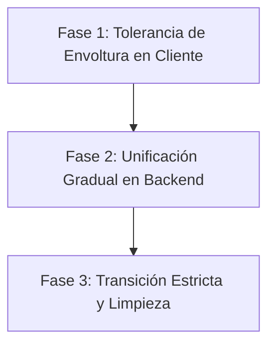

# Plan de Migración de Contrato de API de ParkFlow
**Estado:** `PROPUESTA`  
**Autor:** Staff API Design Architect  

---

## 1. Auditoría de Puntos de Ruptura y Respuestas Peligrosas

Durante la auditoría del monorepo ParkFlow, se identificaron los siguientes patrones que rompen la consistencia del contrato de API y generan deuda técnica en el frontend.

### 1.1 Excepciones `ResponseStatusException` Fuera del Handler Global
Varios controladores lanzan `ResponseStatusException` directamente sin que sean capturadas ni mapeadas al sobre canónico de error de ParkFlow. Esto provoca que Spring Boot responda con su cuerpo de error predeterminado (que no incluye `success: false`, `error.code` ni `traceId`).

**Puntos de Ruptura Clave:**
* [CapacityManagementController.java:39,57](file:///Users/luisdlopera/Documents/projects/cv/parkflow-desktop/apps/api/src/main/java/com/parkflow/modules/configuration/infrastructure/controller/CapacityManagementController.java#L39) — `throw new ResponseStatusException(HttpStatus.UNAUTHORIZED, "Company context required");`
* [HelmetHandlingController.java:39,59](file:///Users/luisdlopera/Documents/projects/cv/parkflow-desktop/apps/api/src/main/java/com/parkflow/modules/configuration/infrastructure/controller/HelmetHandlingController.java#L39) — `throw new ResponseStatusException(HttpStatus.UNAUTHORIZED, "Company context required");`
* [ShiftConfigurationController.java:39,57](file:///Users/luisdlopera/Documents/projects/cv/parkflow-desktop/apps/api/src/main/java/com/parkflow/modules/configuration/infrastructure/controller/ShiftConfigurationController.java#L39) — `throw new ResponseStatusException(HttpStatus.UNAUTHORIZED, "Company context required");`
* [RegionConfigurationController.java:39,57](file:///Users/luisdlopera/Documents/projects/cv/parkflow-desktop/apps/api/src/main/java/com/parkflow/modules/configuration/infrastructure/controller/RegionConfigurationController.java#L39) — `throw new ResponseStatusException(HttpStatus.UNAUTHORIZED, "Company context required");`
* [FeatureConfigurationController.java:43,61](file:///Users/luisdlopera/Documents/projects/cv/parkflow-desktop/apps/api/src/main/java/com/parkflow/modules/configuration/infrastructure/controller/FeatureConfigurationController.java#L43) — `throw new ResponseStatusException(HttpStatus.UNAUTHORIZED, "Company context required");`
* [ModuleConfigurationController.java:39,57](file:///Users/luisdlopera/Documents/projects/cv/parkflow-desktop/apps/api/src/main/java/com/parkflow/modules/configuration/infrastructure/controller/ModuleConfigurationController.java#L39) — `throw new ResponseStatusException(HttpStatus.UNAUTHORIZED, "Company context required");`
* [ThemeConfigurationController.java:29,40,51,61,72,82](file:///Users/luisdlopera/Documents/projects/cv/parkflow-desktop/apps/api/src/main/java/com/parkflow/modules/configuration/infrastructure/controller/ThemeConfigurationController.java#L29) — `throw new ResponseStatusException(HttpStatus.UNAUTHORIZED, "Company context required");`
* [ConfigurationParkingSiteController.java:50](file:///Users/luisdlopera/Documents/projects/cv/parkflow-desktop/apps/api/src/main/java/com/parkflow/modules/configuration/infrastructure/controller/ConfigurationParkingSiteController.java#L50) — `throw new ResponseStatusException(HttpStatus.UNAUTHORIZED, "Company context required");`

### 1.2 Métodos con Retorno `void` (Cuerpo de Respuesta Vacío)
Cuando un controlador tiene tipo de retorno `void`, Spring MVC responde con HTTP 200 y cuerpo vacío (`""`). El middleware de envoltura `ApiResponseWrapperAdvice` no se ejecuta porque no hay convertidor de mensajes de respuesta de datos. Esto hace que el cliente de frontend Next.js falle al intentar parsear el cuerpo mediante `response.json()`, lanzando `SyntaxError: Unexpected end of JSON input`.

**Puntos de Ruptura Clave:**
* [CommunicationSettingsController.java:55,61,67](file:///Users/luisdlopera/Documents/projects/cv/parkflow-desktop/apps/api/src/main/java/com/parkflow/modules/communication/infrastructure/controller/CommunicationSettingsController.java#L55) — `public void testEmailConnection(...)`
* [OperationController.java:235](file:///Users/luisdlopera/Documents/projects/cv/parkflow-desktop/apps/api/src/main/java/com/parkflow/modules/parking/operation/infrastructure/controller/OperationController.java#L235) — `public void updatePlate(...)`
* [LockerController.java:65](file:///Users/luisdlopera/Documents/projects/cv/parkflow-desktop/apps/api/src/main/java/com/parkflow/modules/parking/locker/infrastructure/controller/LockerController.java#L65) — `public ResponseEntity<Void> deleteLocker(...)` (Retorna `ResponseEntity<Void>` que deja el cuerpo totalmente vacío).

### 1.3 Respuestas Desestructuradas Tipo `Map<String, Object>`
El uso de `Map<String, Object>` oculta la definición del modelo de datos de la API, impidiendo generar esquemas OpenAPI consistentes y obligando a los desarrolladores de frontend a realizar lecturas a ciegas y validaciones defensivas.

**Puntos de Ruptura Clave:**
* [OnboardingController.java:97](file:///Users/luisdlopera/Documents/projects/cv/parkflow-desktop/apps/api/src/main/java/com/parkflow/modules/onboarding/infrastructure/controller/OnboardingController.java#L97) — `public ResponseEntity<Map<String, Object>> getCompanySettings(...)`
* [PricingRulesController.java:22](file:///Users/luisdlopera/Documents/projects/cv/parkflow-desktop/apps/api/src/main/java/com/parkflow/modules/pricing/infrastructure/controller/PricingRulesController.java#L22) — `public ResponseEntity<Map<String, Object>> getRulesetForDesktopSync()`
* [CommunicationSettingsController.java:73](file:///Users/luisdlopera/Documents/projects/cv/parkflow-desktop/apps/api/src/main/java/com/parkflow/modules/communication/infrastructure/controller/CommunicationSettingsController.java#L73) — `public Map<String, Object> getStats(...)`
* [AuthController.java:97](file:///Users/luisdlopera/Documents/projects/cv/parkflow-desktop/apps/api/src/main/java/com/parkflow/modules/auth/infrastructure/controller/AuthController.java#L97) — `public Map<String, Object> refreshToken(...)`

### 1.4 Respuestas Fuera de la Envoltura (Bypass del Wrapper)
* **Controladores Fuera de Package**: [RootController.java](file:///Users/luisdlopera/Documents/projects/cv/parkflow-desktop/apps/api/src/main/java/com/parkflow/RootController.java) está ubicado en `com.parkflow` en lugar de `com.parkflow.modules`. Esto provoca que sus endpoints de `/` y `/api/v1/health` retornen mapas planos saltándose el envoltorio `ApiResponse`.
* **Bypass de Strings**: Para evitar el bug de Spring Boot con el `StringHttpMessageConverter` (que arroja `ClassCastException` si `ResponseBodyAdvice` retorna un `ApiResponse` para un retorno originalmente `String`), el wrapper tiene una regla de exclusión estática `if (body instanceof String) { return body; }`. Esto provoca que cualquier controlador que retorne un String (ej. respuestas de prueba o tokens planos) se envíe de manera cruda sin JSON en absoluto, rompiendo el contrato del cliente.

---

## 2. Estrategia de Migración Gradual (Zero-Downtime)

Para alinear el sistema al contrato canónico sin romper los despliegues de frontend y clientes desktop de Tauri que están actualmente activos y esperando respuestas planas o envolturas híbridas, se propone un plan en tres fases.



---

## Fase 1: Tolerancia de Envoltura en Frontend (Compatibilidad Backward)

Antes de hacer cambios estrictos en el backend, debemos garantizar que el cliente de frontend (Next.js) sea tolerante y pueda consumir tanto respuestas con sobre (`ApiResponse`) como respuestas planas (raw DTOs) de forma transparente.

### Implementación del Desempaquetador Dinámico en `safeFetch`
Modificaremos la función central de consumo de red del cliente en [fetch.ts](file:///Users/luisdlopera/Documents/projects/cv/parkflow-desktop/apps/web/src/lib/api/fetch.ts) para desempaquetar automáticamente las respuestas que contengan la estructura canónica.

```typescript
// En apps/web/src/lib/api/fetch.ts
export async function safeFetch<T = unknown>(input: RequestInfo | URL, init?: RequestInit): Promise<T> {
  // ... lógica de obtención de tokens y CSRF ...
  const response = await fetchWithCredentials(input, { ...init, headers: csrfHeaders });
  
  if (!response.ok) throw await extractResponseError(response, requestUrl);
  if (response.status === 204) return {} as T;

  const rawJson = await response.json();

  // Desempaquetado inteligente
  if (
    rawJson &&
    typeof rawJson === "object" &&
    "success" in rawJson &&
    "data" in rawJson &&
    "meta" in rawJson
  ) {
    // Si la llamada falló a nivel lógico (aunque regresara 200 HTTP, caso borde)
    if (!rawJson.success) {
      throw new ApiError(rawJson.message || "Lógica de negocio fallida", {
        status: response.status,
        code: rawJson.error?.code || "",
        correlationId: rawJson.error?.traceId || rawJson.meta?.requestId || "",
        details: rawJson.error?.details,
        payload: rawJson
      });
    }
    
    // Si el tipo esperado T espera la estructura con sobre (ej. meta o paginación explícita)
    // o si el llamador del fetch maneja directamente la respuesta envuelta.
    const isExpectingEnvelope = init?.headers && getHeader(init.headers, "X-Expect-Envelope") === "1";
    if (isExpectingEnvelope) {
      return rawJson as unknown as T;
    }

    // De lo contrario, extraemos data automáticamente para mantener compatibilidad backward
    return rawJson.data as T;
  }

  // Si no venía envuelto en el contrato canónico, retornamos el JSON plano
  return rawJson as T;
}
```

**Beneficios:**
* El frontend deja de requerir condicionales manuales del tipo `(payload.data ?? payload)`.
* Evita que el cambio de formato en el backend rompa las pantallas existentes de tarifas, usuarios o convenios.
* Los tests unitarios del frontend que mockean respuestas crudas seguirán pasando sin requerir refactorizaciones masivas inmediatas.

---

## Fase 2: Unificación Gradual en el Backend

Una vez que el frontend es seguro y tolerante, procedemos a realizar las siguientes correcciones de infraestructura en Spring Boot:

### 2.1 Estandarización del Control de Errores de `ResponseStatusException`
Agregaremos un manejador específico para `ResponseStatusException` en [GlobalExceptionHandler.java](file:///Users/luisdlopera/Documents/projects/cv/parkflow-desktop/apps/api/src/main/java/com/parkflow/modules/common/exception/GlobalExceptionHandler.java):

```java
@ExceptionHandler(org.springframework.web.server.ResponseStatusException.class)
public ResponseEntity<ApiResponse<Void>> handleResponseStatusException(
        org.springframework.web.server.ResponseStatusException ex, HttpServletRequest request) {

    String correlationId = MDC.get(CORRELATION_ID_MDC_KEY);
    
    ApiResponse<Void> response = ApiResponse.error(
        ex.getReason() != null ? ex.getReason() : "Acción no permitida",
        "HTTP_" + ex.getStatusCode().value(),
        request.getRequestURI(),
        correlationId,
        Map.of("developerMessage", ex.getMessage())
    );

    return ResponseEntity.status(ex.getStatusCode()).body(response);
}
```

### 2.2 Reordenamiento de Convertidores de Mensaje para Evitar Bypass de Strings
Para eliminar la regla peligrosa de bypass de Strings y permitir que las cadenas de texto se devuelvan en formato JSON envuelto, configuraremos Spring MVC para posicionar el serializador Jackson por delante del serializador String de Spring:

```java
// En apps/api/src/main/java/com/parkflow/config/WebMvcConfig.java
@Override
public void configureMessageConverters(List<HttpMessageConverter<?>> converters) {
    // Colocar el convertidor de JSON (Jackson) al inicio de la lista
    // Esto evita que StringHttpMessageConverter intente procesar objetos ApiResponse
    converters.add(0, new MappingJackson2HttpMessageConverter(objectMapper()));
}
```
*Una vez configurado esto, podemos eliminar el bypass `if (body instanceof String)` de `ApiResponseWrapperAdvice`.*

### 2.3 Solución de Cuerpo Vacío para Métodos `void`
Modificaremos `ApiResponseWrapperAdvice` para interceptar retornos `void` y asegurar que el cuerpo no sea `null` (devolviendo una envoltura estándar con `data: null`):

```java
// En ApiResponseWrapperAdvice.java beforeBodyWrite:
if (body == null || returnType.getParameterType().equals(void.class) || returnType.getParameterType().equals(Void.class)) {
    return new ApiResponse<>(
        true,
        null,
        ApiMeta.defaultMeta(path, traceId),
        null,
        "Operación realizada correctamente"
    );
}
```

---

## Fase 3: Transición Estricta y Limpieza

Una vez que todas las rutas han sido migradas y validadas:
1. **Remoción de Bypasses en Frontend**: Se eliminarán los mapeos condicionales redundantes en componentes frontend (ej. `payload.data ?? payload`).
2. **Generación automática de Clientes**: Al tener un contrato estrictamente tipado, usaremos generadores de código OpenAPI para compilar interfaces TypeScript y Rust (Tauri) libres de discrepancias manuales.
3. **Depuración de Excepciones del Negocio**: Reemplazaremos todas las excepciones genéricas o `ResponseStatusException` en controladores por `BusinessException` especializadas del dominio.
