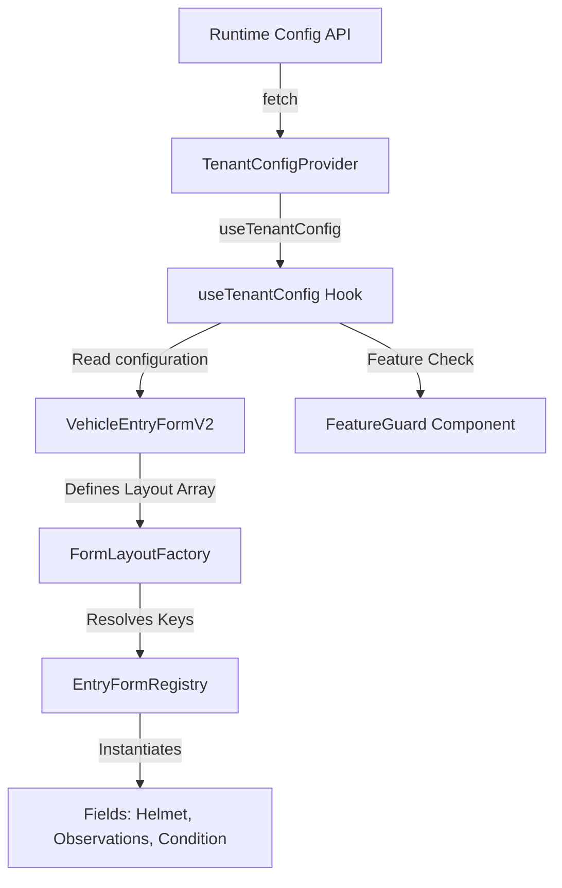

# Arquitectura de UI Dinámica y Configurable (SaaS Multi-tenant)

Parkflow utiliza un enfoque modular y dirigido por configuraciones (**Metadata-Driven UI**) para controlar de manera dinámica la visibilidad e interactividad de los campos en el frontend. Esto se inspira en patrones de diseño utilizados por Salesforce y Atlassian para permitir que diferentes sedes o empresas (tenants) habiliten o deshabiliten componentes de UI dinámicamente según su modelo operativo (por ejemplo, parqueaderos exclusivos de motos).

---

## 1. Componentes Clave

La arquitectura consta de tres piezas fundamentales:



### A. Contexto Operativo del Tenant (`TenantConfigProvider`)
Ubicación: `apps/web/src/lib/providers/TenantConfigProvider.tsx`

Encapsula la configuración obtenida desde el backend (`fetchRuntimeConfig`) y proporciona métodos utilitarios rápidos para consultar permisos y capacidades operativas sin esparcir código repetitivo ni realizar fetches duplicados:
*   `supportsVehicleType(code)`: Determina si la sede actual acepta ese tipo de vehículo.
*   `isModuleEnabled(key)`: Determina si el módulo (ej. caja, reportes) está habilitado.
*   `getOperationConfigValue(key, defaultValue)`: Retorna un valor de configuración operativo de tipo genérico (boolean, string, numbers, arrays).

### B. Guardas de UI (`FeatureGuard`)
Ubicación: `apps/web/src/components/shared/FeatureGuard.tsx`

Componente declarativo que envuelve secciones de la aplicación para mostrarlas u ocultarlas según permisos o tipo de vehículo. Evita el uso de condicionales visuales embebidos.
```tsx
import { FeatureGuard } from "@/components/shared/FeatureGuard";

// Solo se renderiza si el parqueadero soporta motocicletas
<FeatureGuard vehicleType="MOTORCYCLE">
  <HelmetSection />
</FeatureGuard>
```

### C. Fábrica de Formularios (`FormLayoutFactory` + `EntryFormRegistry`)
Ubicación: `apps/web/src/components/forms/dynamic/`

Los campos complejos o condicionales ya no se programan de forma fija dentro del formulario principal. En su lugar:
1.  **Registry (`form-registry.ts`):** Mapea un identificador de campo (`string`) a su componente React.
2.  **Factory (`FormLayoutFactory.tsx`):** Renderiza los campos dinámicamente según un arreglo de configuración (`layout`), asociándolos a `react-hook-form`.

---

## 2. Guía paso a paso: ¿Cómo agregar un nuevo campo dinámico?

Si deseas agregar un nuevo campo (por ejemplo, "Lavado de Vehículo" o "Peso de Carga" para camiones):

### Paso 1: Crear el Componente del Campo
Crea el nuevo campo dentro de `apps/web/src/components/forms/dynamic/fields/VehicleWashInput.tsx`. El componente debe consumir `useTenantConfig` para decidir si se auto-oculta y usar `Controller` de `react-hook-form`:

```tsx
import { Controller, Control } from "react-hook-form";
import { Input } from "@heroui/input";
import { useTenantConfig } from "@/lib/hooks/useTenantConfig";

export function VehicleWashInput({ control }: { control: Control<any> }) {
  const { getOperationConfigValue } = useTenantConfig();
  const enableWashService = getOperationConfigValue<boolean>("enableWashService", false);

  if (!enableWashService) return null;

  return (
    <Controller
      name="washService"
      control={control}
      render={({ field }) => (
        <Input {...field} label="Servicio de Lavado" placeholder="Ej. Básico, Polichado" variant="flat" size="sm" />
      )}
    />
  );
}
```

### Paso 2: Registrar el Campo
Abre `apps/web/src/components/forms/dynamic/form-registry.ts` e importa tu nuevo componente para añadirlo al registro:

```typescript
import { VehicleWashInput } from "./fields/VehicleWashInput";

export const EntryFormRegistry = {
  // ... campos existentes
  wash_service: VehicleWashInput,
} as const;
```

### Paso 3: Declarar en el Layout
En `VehicleEntryFormV2.tsx`, añade tu nuevo campo al arreglo de layouts:

```typescript
const ENTRY_FORM_LAYOUT: RegisteredFieldKey[] = [
  "vehicle_condition",
  "helmet_section",
  "wash_service", // Tu nuevo campo dinámico se cargará aquí automáticamente
  "observations",
];
```

Si en el futuro deseas que este orden venga completamente del backend (Salesforce Style), solo debes cambiar el origen del arreglo `ENTRY_FORM_LAYOUT` para que se lea de `runtimeConfig?.operationConfiguration?.layoutSchema` en lugar del array estático.

---

## 3. Beneficios Obtenidos

*   **Reducción del código del formulario principal:** `VehicleEntryFormV2.tsx` se redujo en más de 80 líneas y removió dependencias pesadas de imports.
*   **Separación de responsabilidades:** Cada sección dinámica (cascos, estado del vehículo) ahora se testea, mantiene y documenta de forma independiente.
*   **Extensibilidad:** Agregar campos avanzados a futuro no requiere modificar la lógica interna del formulario de ingreso.

---

## 4. Vista de Salida y Cobro (`salida-cobro`)

La vista de salida en [salida-cobro/page.tsx](file:///Users/luisdlopera/Documents/projects/cv/parkflow-desktop/apps/web/src/app/(dashboard)/salida-cobro/page.tsx) también se ha conectado a esta arquitectura dinámica:
*   **Estado del Vehículo en Salida:** Se muestra condicionalmente utilizando `enableVehicleCondition`. Si la empresa tiene deshabilitado este control de novedades, la interfaz oculta la caja de texto, previniendo inputs innecesarios y agilizando el flujo del cajero.
*   **Alerta de Custodias (Cascos):** Aunque la sesión registre cascos cargados, el panel de confirmación de devolución solo se muestra si `enableCustodiedItem` está activo en la sede.

---

## 5. Análisis Técnico: Configuración para Parqueaderos Mixtos vs Únicos

La modularidad nos permite optimizar la experiencia de usuario (UX) dependiendo de si el parqueadero opera con un modelo mixto o especializado:

| Característica / Vista | Parqueadero Mixto | Parqueadero Único (ej. Solo Motos) |
| :--- | :--- | :--- |
| **Selector de Vehículo (Ingreso)** | **Visible:** Muestra botones rápidos (1-5) para elegir el tipo. | **Oculto:** Se autoselecciona `MOTORCYCLE` y el grid de botones desaparece. |
| **Sección de Custodia / Cascos** | **Dinámico:** Se muestra únicamente si se selecciona "Moto" en el formulario. | **Siempre Habilitado:** Forma parte del flujo principal de ingreso/salida. |
| **Novedades y checklist de estado** | **Configurable:** Opcional por tipo de vehículo (ej. solo carros). | **Apagado:** Desactivado por completo en motos para agilizar la entrada. |
| **Formatos de Placa** | **Estrategia Variable:** Aplica reglas Zod dinámicas según el tipo seleccionado. | **Estrategia Fija:** Forzado a la estructura de placa exclusiva (ej. 3 letras + 2 números + 1 letra). |

